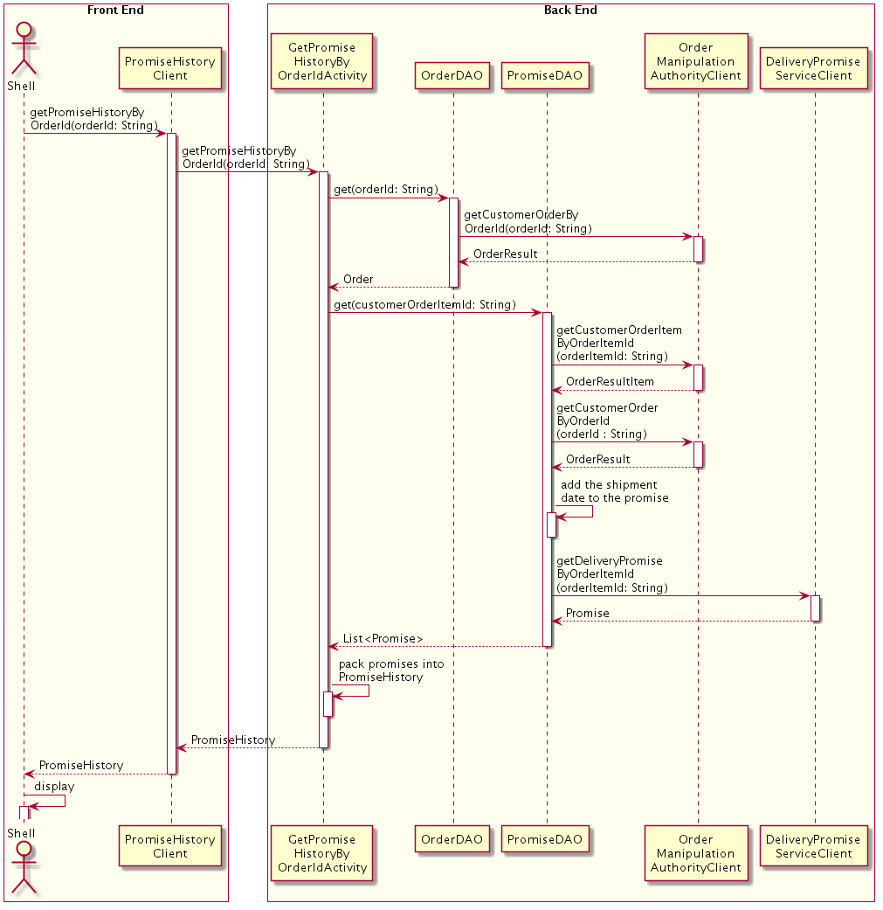

# PromiseDao Design Review

## Overview

What's the problem with the way the PromiseDao currently works?

- The PromiseDao only supports one source for promises: the Delivery Promise Service (DPS). We already need to get promises from another service, the Order Fulfillment Service (OFS), so this is a good time to make the design more flexible. 

## Use Cases

What ways will the CS representatives use the new multiple-client PromiseDao?

- The CS rep will be able to pull promises from the Order Fulfillment Center as well as the 
  Order Manipulation Client and the Delivery Promise Service Client

In a few sentences, how does the PromiseDao work right now?

- Currently the Promise Data Access Object is only getting promises from 
  the Order Manipulation Client and the Delivery Promise Service Client

Consider a developer unfamiliar with the Missed Promise CLI. Can you add diagrams here that will help them understand how the PromiseDao works right now?

- 

## Proposed Solution

Describe in a few sentences how your changes will satisfy the use cases you listed above. How will you enable getting promises from OFS? How will you allow new promise sources to be added easily in the future?

- 

## Out of Scope

Consider a reviewer who misunderstands this design and believes you're going to make the PromiseDao perfect. What are you not going to do? 

- 

## Details

Include a UML diagram that will help clarify the changes you want to make.
You can leave out classes that don't participate in the new solution, but you should leave in anything that uses your updates. For instance, even if you don't change the `GetPromiseHistoryByOrderIdActivity`, it's going to use the `PromiseDao` that you changed, so you should leave it in. Also make sure to include a link to the PlantUML source. Pro Tip: you can change a class's [color](http://plantuml.com/color) by adding “#colorname” after its name! (For example, #lightgrey visually indicates that although a class is involved, it's not a major discussion point right now).

In detail, what calls will the software make, and how will it process the results? You may use a single narrative, but it should satisfy all of the use cases you described above.

- 

What do you expect the complexity (BigO) of this solution to be, and why? Clearly define the variable(s) you're using in your BigO notation.

- 

## Potential Issues

What could go wrong with your solution? What would surprise a customer service rep who was trying to perform one of the use cases? If you can't think of anything, remove this section.

- 
